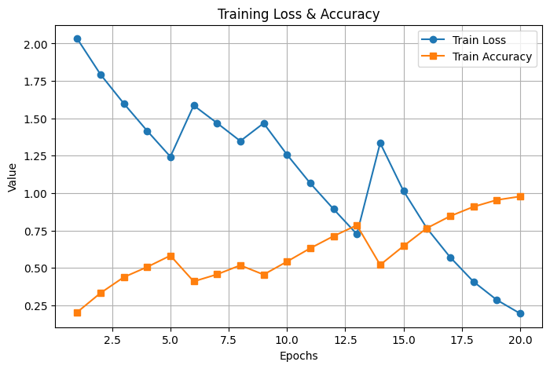

## Dataset

#### Dataset used in this project: https://www.kaggle.com/datasets/sardarabdulmoizkhan/emotiondetectiondataset with 10% sample
The project should be like
```
/
├── README.md
├── train.ipynb
├── tracker.ipynb
├── data/
│   └── dataset_place_here/
```

#### Alt dataset
fer2013: https://www.kaggle.com/datasets/msambare/fer2013

Source for 96x96 dataset: https://www.kaggle.com/datasets/fatihkgg/affectnet-yolo-format/data 

Source for 48x48 dataset: https://www.kaggle.com/datasets/jonathanoheix/face-expression-recognition-dataset/data?select=images

Other: https://www.kaggle.com/datasets/furcifer/fane-facial-expressions-and-emotion-dataset
but some of files are fuck up including:
- happy1283.jpg
- surprise400.jpg
- confused694.jpg
- confused695.jpg
- confused696.jpg
so delete it. Other wise it will throw "cannot identify image file <_io.BufferedReader name='data\\fane_data\\e\\exyz.jpg'>"

bad 224x224 reannotion fer: https://www.kaggle.com/datasets/sudarshanvaidya/corrective-reannotation-of-fer-ck-kdef

4gb 224x224 yolo format: https://www.kaggle.com/datasets/aklimarimi/8-facial-expressions-for-yolo

2gb 224x224 https://www.kaggle.com/datasets/sardarabdulmoizkhan/emotiondetectiondataset

Please dowload the dataset in the [link] to continue.

## Train the model
The training process will be in train.ipynb

I used transfer learning method with pre-trained model from torch. I cooked with colab and my network.

This is my training result for 20 epochs using i7-11657, 16GB ram and no VGA with 10% sample:

Training time approximately 400mins.

## Test the model
Testing dataset used include: 
1. a small part of training dataset
2. https://www.kaggle.com/datasets/tapakah68/facial-emotion-recognition
3. https://www.kaggle.com/datasets/mh0386/facial-emotion

You can use your webcam as a way to test the model by running tracker.ipynb but please change the path to the model.

